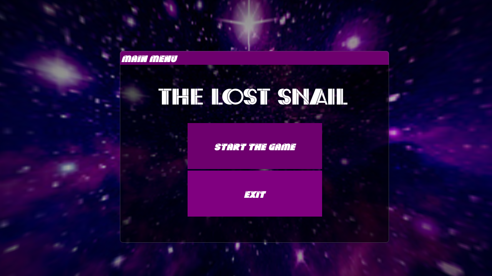
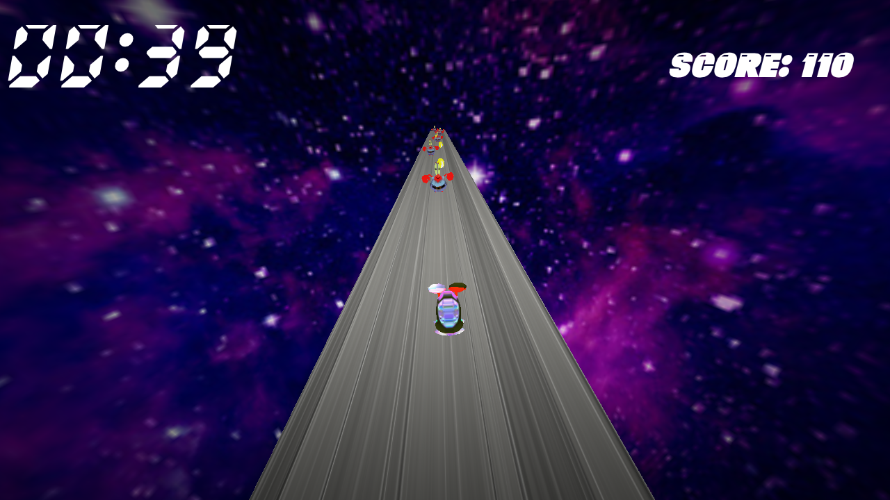
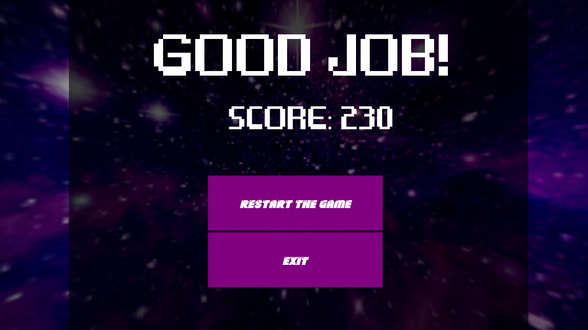

# The Lost Snail

<p align="center">
  <a href="" rel="noopener">
 </a>
</p>
<p align="center">
    <br> 
</p>
<div align="center">

[](https://github.com/mhmdahmedfathi/The-lost-Snail/contributors)
[](https://github.com/mhmdahmedfathi/The-lost-Snail/issues)
[](https://github.com/mhmdahmedfathi/The-lost-Snail/network)
[](https://github.com/mhmdahmedfathi/The-lost-Snail/stargazers)
[](https://github.com/mhmdahmedfathi/The-lost-Snail/LICENSE)

</div>

## About

 Help the Snail to return to its planet after being lost in the galaxy.
 Help him by avoid collision with Mr Craps and Make him get more coins to get new high score.


## 🏁 Get Started <a name = "Install"></a>
1. **Clone the repository**
```
git clone https://github.com/mhmdahmedfathi/The-lost-Snail
```
2. **Install Visual Studio Code**


3. **Open the folder in Visual Studio Code**


4. **Build the project**


4. **Open a terminal (Terminal > New Terminal)**


5. **Run this Command**
```
.\bin\GAME_APPLICATION.exe
```

## 💻 Built Using <a name = "tech"></a>
- [C++]()
- [OpenGL](https://www.opengl.org/)

## 🎮How to play

### use

- Use *←* to move left.
- Use *→* to move right.

## or you can use

- Use *A* to move left.
- Use *D* to move right.

## 📷 Screenshots

<div name="Screenshots" align="center">
   
   <hr>
    
    <hr>
    if you win, you will find
   
   <hr>
   else if you lose, you will find
   
   <hr>
</div>
